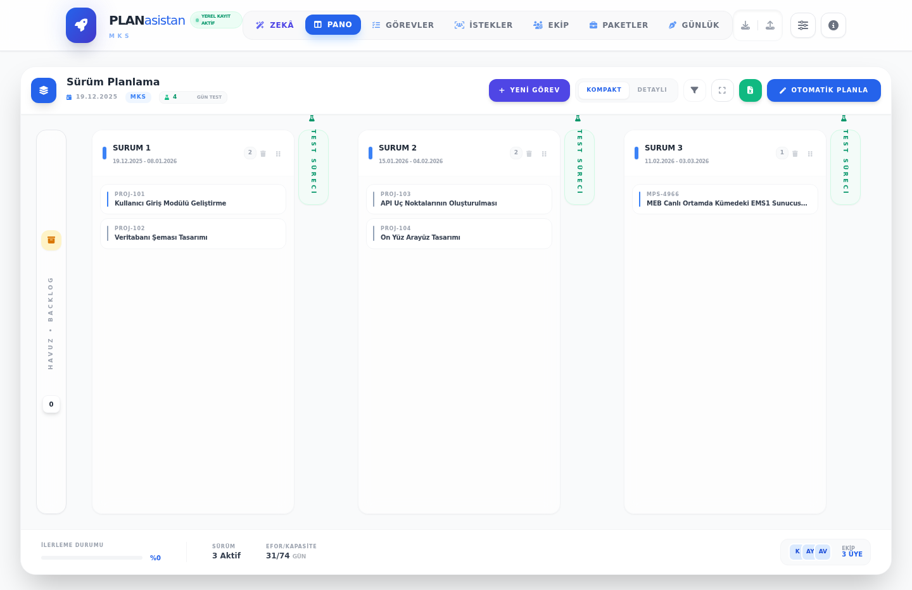

# PlanAsistan MKS - Google Ai Studio Project
# PlanAsistan - Akıllı Proje Planlama Aracı
PlanAsistan MKS; proje görevlerini PERT/Fuzzy PERT yaklaşımıyla planlayan, sprint bazlı Kanban yönetimi sunan ve ekip/kaynak takibini tek ekranda birleştiren bir web uygulamasıdır. Görevler, kaynaklar, iş paketleri, müşteri istekleri ve notlar birbirine bağlı çalışır; AI asistanı da bu verileri kullanarak içgörü ve özetler üretir.

PlanAsistan, PERT ve Bulanık Mantık (Fuzzy PERT) yöntemlerini kullanarak proje görevlerini otomatik olarak planlayan, kaynakları yöneten ve sürüm takvimi oluşturan gelişmiş bir web uygulamasıdır.
## 🖼️ Uygulama Görseli

## 🚀 GitHub Üzerinden Canlı Kullanım (Deployment)


Bu uygulamayı GitHub üzerinden canlıya almak ve bir web sitesi gibi kullanmak için şu adımları izleyin:

1.  **GitHub Pages'i Etkinleştirin:**
    - GitHub deponuzun (repository) üst menüsünden **Settings** sekmesine gidin.
    - Sol sütundan **Pages** seçeneğine tıklayın.
    - **Branch** kısmından `main` (veya kodlarınızın olduğu ana dal) seçin ve yanındaki klasörü `/(root)` olarak bırakıp **Save** deyin.
    
2.  **Erişim:**
    - Birkaç dakika sonra sayfanın üstünde "Your site is live at..." şeklinde bir link belirecektir. Uygulamanıza bu link üzerinden her yerden erişebilirsiniz.
Farklı araçlarda dağınık duran görev, ekip ve planlama verileri; sprint takibi ve teslim tarihlerini netleştirmeyi zorlaştırır. PlanAsistan, bu ihtiyacı tek bir merkezde toplayarak planlamayı **şeffaf**, **ölçülebilir** ve **sürdürülebilir** hale getirmek için geliştirildi.

## ✅ Neden PlanAsistan?
## ✨ Temel Özellikler
- **Planlama netliği**: Süre tahminleri ve bağımlılıklarla gerçekçi takvimler oluşturur.
- **Sprint görünürlüğü**: Sprint sütunları ve test periyodu ile ilerlemeyi anlık gösterir.
- **Ekip dengesi**: Kapasite ve ünvan maliyetleri ile daha sağlıklı iş dağılımı sağlar.
- **Tek merkez**: Görevler, istekler, notlar ve iş paketlerini tek ekranda birleştirir.

- **Otomatik Planlama:** PERT algoritması ile görevleri en verimli sürüm (sprint) takvimine yerleştirir.
- **Kanban Panosu:** Sürüm bazlı, sürükle-bırak destekli görsel görev yönetimi.
- **Analiz & Zaman Çizelgesi:** Proje bitiş tarihini ve kritik yolu hesaplayan Gantt şeması.
- **Akıllı Notlar:** `#anımsatıcı` etiketi ile notlarınızdan otomatik hatırlatıcılar oluşturun.
- **Excel & Jira Desteği:** Verilerinizi Excel veya Jira formatında içe/dışa aktarın.
- **PWA Desteği:** Bilgisayarınıza veya telefonunuza uygulama olarak yükleyip çevrimdışı kullanabilirsiniz.

## 🛠️ Yerel Geliştirme
Uygulamayı GitHub Pages üzerinden canlıya almak için:

Projeyi kendi bilgisayarınızda çalıştırmak isterseniz:
1. Depoyu indirin: `git clone https://github.com/kullaniciadi/depo-adi.git`
2. Bir web sunucusu ile (örn: VS Code Live Server) `index.html` dosyasını açın.
1. Depo sayfanızda **Settings** sekmesine gidin.
2. Sol menüden **Pages** seçeneğini seçin.
3. **Branch** olarak `main` (veya ana dalınız) ve klasör olarak `/(root)` seçin, ardından **Save** deyin.
4. Birkaç dakika sonra “Your site is live at...” bağlantısı görünür. Uygulamanıza bu link üzerinden erişebilirsiniz.

---
*Bu proje modern web standartları (ES6+, Tailwind CSS) kullanılarak build işlemine gerek kalmadan çalışacak şekilde tasarlanmıştır.*
## 🧩 İşlevler ve Faydalar

- **PERT/Fuzzy PERT planlama**: Belirsiz süreleri daha doğru ele alarak planlama riskini azaltır.
- **Kanban + sprint akışı**: Sürüm odaklı ilerleme ile teslim tarihlerini görünür kılar.
- **Ekip kapasite dengesi**: Kaynak ve ünvan maliyetleri ile gerçekçi planlama yapmanızı sağlar.
- **Müşteri istekleri yönetimi**: Talepleri hızlıca görevleştirip backlog’a ekleyebilirsiniz.
- **Notlar ve hatırlatıcılar**: Gündelik kararları tek yerde toplayarak ekip hafızasını güçlendirir.
- **AI destekli analiz**: Görev/kaynak verilerinden özet, risk ve öncelik önerileri üretir.

## ✨ Öne Çıkan Özellikler

- **Akıllı planlama**: PERT tabanlı planlama, kritik yol ve zaman çizelgesi görünümü.
- **Kanban ve sprint yönetimi**: Sprint sütunları + test dönemi ile release planlama.
- **Görev galerisi**: Durum/etiket filtreleri, hızlı düzenleme ve detay modalı.
- **Ekip & maliyet yönetimi**: Kaynak listesi, ünvan bazlı maliyetler ve kapasite bilgileri.
- **İş paketleri (work packages)**: Paket bazlı görev gruplama ve takip.
- **Müşteri istekleri**: Yeni isteklerin kaydı, hızlı görevleştirme.
- **Notlar ve hatırlatıcılar**: Günlük notlar, etiketlerle hatırlatıcı üretimi.
- **Yedekleme/geri yükleme**: JSON olarak dışa/içe aktarma.
- **AI asistanı**: Google Gemini ile proje verilerine dayalı analiz ve öneriler.
- **PWA desteği**: Manifest + Service Worker ile çevrimdışı kullanım.

## 🧭 Hızlı Başlangıç

1. **Bağımlılıkları yükleyin**
   ```bash
   npm install
   ```
2. **Geliştirme sunucusunu başlatın**
   ```bash
   npm run dev
   ```
3. Tarayıcıda `http://localhost:5173` adresine gidin.

## 🧰 Teknoloji Yığını

- **React 19 + TypeScript**
- **Vite** (geliştirme ve build)
- **Tailwind CSS** (yardımcı sınıf yaklaşımı)
- **Google Gemini SDK** (`@google/genai`)

## 🚀 Kurulum & Çalıştırma

### Gereksinimler

- Node.js 18+ (önerilir)
- npm

### Geliştirme

```bash
npm install
npm run dev
```

### Üretim derlemesi

```bash
npm run build
npm run preview
```

## 🔑 AI Asistanı (Google Gemini)

AI sekmesi aktif olduğunda uygulama sizden **Gemini API anahtarı** seçmenizi ister. Seçim `window.aistudio` üzerinden yapılır ve güvenli şekilde aktarılır. Yerel geliştirme için gerekirse `.env` içine aşağıdaki değeri ekleyebilirsiniz:

```
API_KEY=your_gemini_api_key
```

> Not: Uygulama, yerel kelime filtresi ve Gemini güvenlik ayarlarını birlikte kullanır.

## 💾 Veri Saklama ve Yedekleme

- Tüm veriler **localStorage** üzerinde tutulur.
- Ayarlar ekranından yerel kayıt **aç/kapat** yapılabilir.
- Üst menüden **Yedekle / Yükle** ile JSON export/import yapılabilir.

## 🧩 Kullanım Notları

- **Görevler**: Görev oluştururken süre tahmini ve etiket ekleyerek planlamayı iyileştirebilirsiniz.
- **Kaynaklar**: Ünvan maliyetleri toplam maliyeti daha doğru hesaplamak için kullanılır.
- **İş paketleri**: Büyük işleri parçalayarak yönetmek için paket oluşturun ve görevleri bağlayın.
- **Müşteri istekleri**: Gelen istekleri görevleştirerek backlog’a ekleyin.

## 📦 Proje Yapısı (Özet)

```
.
├── App.tsx
├── components/
├── constants.ts
├── types.ts
├── sw.js
├── manifest.json
└── ...
```

## 🧪 Test

Bu repo için özel bir test komutu yoktur. Çalışmayı doğrulamak için `npm run dev` ile uygulamayı açıp temel akışları kontrol edebilirsiniz.

## 📄 Lisans

Bu proje dahili kullanım için hazırlanmıştır. Lisans bilgisi eklemek isterseniz bu bölümü güncelleyebilirsiniz.
