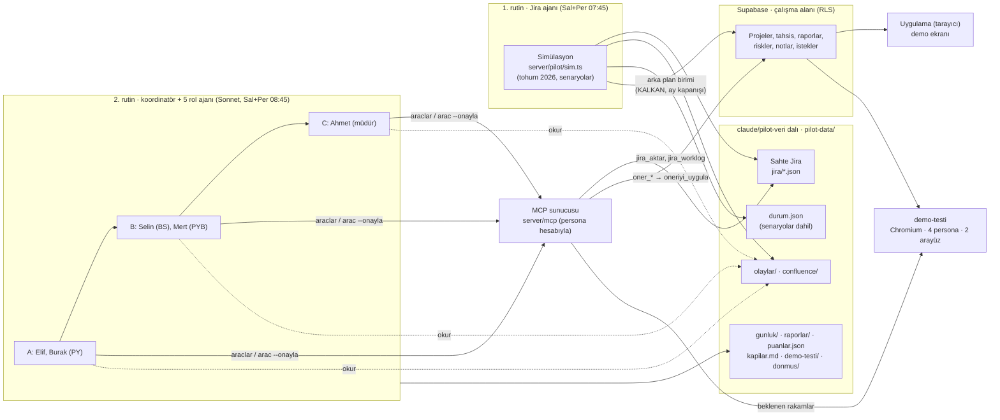

# PlanAsistan pilotu — sahte veri + yapay zekâ kullanıcıları

Uygulamayı, gerçek veri olmadan, "kullanılıyormuş gibi" sınamak için iki rutin. Pilot 15 Ekim–26 Kasım 2026 arasında çalışır ve **yönetim demosu bu ortamın kendisidir**: sunumda gösterilen çalışma alanı, beş ajanın altı hafta boyunca üzerinde çalıştığı alandır. Ajanın uygulamaya yazmadığı iş demoda yoktur; bu yüzden ajanların her kararı (rapor, risk, istek, not, RAG, tahsis) MCP araçlarıyla uygulamaya yazılır.

| Rutin | Ne yapar | Talimat |
|---|---|---|
| **1. Jira ajanı** (Salı + Perşembe 07:45) | Son koşudan bu yana geçen günleri üretir. **Sahte Jira**: yeni kayıt, işe başlama, worklog, kapanış, yeniden açılma; gerçek Jira REST API'siyle aynı biçimde. Ayrıca Confluence tarzı toplantı/karar notları, arka plandaki birim (haftalık rapor akışı, ay başı gerçekleşen adam-ay, KALKAN'ın PY'si), ara sıra müşteri isteği ve yönetimden beklenti. Yapay zekâ günün akışına uygun notlar ekler. | [`RUTIN_1_VERI.md`](./RUTIN_1_VERI.md) |
| **2. Rol ajanları** (Salı + Perşembe 08:45) | Otomatik kontroller; sonra 5 rol ajanı uygulamayı MCP üzerinden kendi rolleriyle **koşu başına bir kez, üç aşamada** kullanır: önce PY'ler, sonra bölüm sorumlusu ve PYB destek, en son müdür. PY'ler koşuya Jira'dan aktarımla başlar (`jira_aktar`), Perşembe haftalık raporu yazar. Koordinatör ön puan önerir, kullanıcı puanı ajanlara geri döner; karar "demoya hazır mı?" sorusuna verilir. | [`RUTIN_2_KULLANICILAR.md`](./RUTIN_2_KULLANICILAR.md) |

Senaryo takvimi, ara kapılar (K0–K4) ve demo günü protokolü: [`SENARYOLAR.md`](./SENARYOLAR.md) (yalnız Jira ajanı ve koordinatör okur). Kod dalı `claude/nice-cerf-r9wv1r` (main + PR #49 + pilot v3).

## Sistem tasarımı



- **Tek doğru kaynak** uygulamanın Supabase çalışma alanıdır; sahte Jira ve simülasyon durumu dalda durur. Ajanlar uygulamaya yalnız MCP'den, kendi hesaplarıyla, öneri → onay akışıyla yazar; rolleri üyelikten gelir ve RLS gerçekteki gibi uygulanır.
- **Haftalık rapor akışı** uygulamanın kendi akışıdır: PY `haftalik_rapor_taslagi` (uygulamanın AI paketi) → `oner_haftalik_rapor` (AI taslağı ve gönderilen hâl birlikte saklanır) → Selin `oner_rapor_karari` (Perşembe) → Mert biçim onayı ve `oner_hafta_yayinla` (Salı) → müdür yayınlananı görür.
- **Demo güvencesi:** `demo-testi` ekranları gerçek tarayıcıda gezer ve sağlık puanını MCP ile karşılaştırır; her kapıda `dondur` ile geri dönülebilir kopya alınır, `geri-yukle` aynı çalışma alanını yerinde eski hâline getirir.

Uygulamanın çalışma alanı **Supabase'de** durur (aşağıda "Bulut modu"); sahte Jira, simülasyon durumu, olaylar, raporlar ve bulgular **`claude/pilot-veri`** dalında (`pilot-data/`, kod dalına karışmaz).

## Bulut modu (Supabase)

Pilot verisi uygulamanın kendi bulut senkronizasyonuyla aynı tablolardadır (`supabase/schema.sql`); ajanların yaptığı her değişikliği tarayıcıdan izleyebilirsiniz.

| Hesap | Rol | Kim kullanır |
|---|---|---|
| `pilot-jira@example.com` | çalışma alanı sahibi (PYB Destek) | 1. rutin — sunucu anahtarıyla yazar |
| `pilot-elif@…`, `pilot-burak@…` | Proje Yöneticisi | 2. rutin |
| `pilot-selin@…` | Bölüm Sorumlusu | 2. rutin |
| `pilot-mert@…` | PYB Destek | 2. rutin |
| `pilot-ahmet@…` | Müdür (notlar RLS ile kapalı) | 2. rutin |
| sizin hesabınız | PYB Destek (izleyici, her şeyi görür) | tarayıcıdan izleme |

Pilot hesapları kurulumda açılır (e-posta gönderilmez, `@example.com`); hepsinin parolası `PILOT_PASSWORD`'dür; bu değişken verilmezse (ya da 12 karakterden kısaysa) parola sunucu anahtarından türetilir (uzun, tahmin edilemez; anahtar yenilenince `pilot uyeler` hesapları eşitler). Personalar MCP sunucusuna kendi hesaplarıyla bağlanır — rolleri üyelikten gelir, RLS gerçekte olduğu gibi uygulanır. `kontrol` bunu da sınar (üyelik rolleri, müdürün notları veritabanından okuyamaması/yazamaması, PY'nin okuyabilmesi; stdio satırında MCP paketi bir personanın hesabıyla gerçekten bağlanır).

**Kurulum (bir kez):**

1. Bulut ortamının ayarlarında (Claude Code › ortam › değişkenler) üç değişken: `PILOT_SUPABASE_URL`, `PILOT_SUPABASE_ANON_KEY` (anon ya da `sb_publishable_…`), `PILOT_SUPABASE_SERVICE_ROLE_KEY` (service_role ya da `sb_secret_…` — yalnız burada durur). İsteğe bağlı `PILOT_PASSWORD` (pilot hesaplarına tarayıcıdan da girmek isterseniz; en az 12 karakter). İsteğe bağlı `PILOT_IZLEYICILER=siz@ornek.com` (virgülle birden çok; `e-posta:rol` ile rol seçilebilir). Değerleri sohbete ya da depoya yazmayın.
2. Ağ erişimi: ortamın izinli alan adlarına `*.supabase.co`.
3. İzleyici hesabınızla uygulamadan bir kez **Kayıt ol / Giriş yap**.
4. 1. rutin bir sonraki çalışmasında veriyi taşır (`buluta-tasi`) ya da kurar (`baslat`) ve **çalışma alanı kimliğini** (`ozet` → `calisma_alani`) özetinde yazar. İzleyici sonradan eklenecekse: `npm run -s pilot -- uyeler --izleyici siz@ornek.com`.

**İzleme:** uygulamada Bulut Senkronizasyonu › aynı Project URL ve anon anahtarı › giriş › çalışma alanı kimliğiyle **Bağlan** (veri iner). Sonraki günlerde **Buluttan Çek**. Tarayıcıda yaptığınız değişiklikler de (otomatik gönderim açıksa) pilot verisine yazılır; ajanlar ertesi gün onları görür. `baslat --zorla` aynı çalışma alanını yerinde yeniler: kimlik ve üyelikler değişmez, yalnız "Buluttan Çek" gerekir.

`pilot-data/bulut.json` yalnız çalışma alanı kimliğini ve Supabase adresinin alan adını tutar (kimlik bilgisi yok). Dosya yoksa pilot eskisi gibi `pilot-data/workspace.json` ile çalışır (`baslat --dosya`).

## Kurgusal birim

5 bölüm (U300 PYB, U310 Yazılım, U320 Test, U330 Sistem, U340 Veri ve YZ), 24 kişi, 5 proje:

| Proje | Jira | PY | Durum | Özellik |
|---|---|---|---|---|
| ATLAS Karar Destek Sistemi | ATL | Elif Yılmaz | Devam, plan **kilitli** | Dengeli; ekipte kapasite üstü iki kişi (KALKAN ile paylaşılan) |
| PUSULA Saha Mobil Uygulaması | PSL | Burak Demir | Devam, plan onayda | Sınırda; PY bazen raporu geç gönderir |
| NEHİR Veri Platformu | NHR | Burak Demir | Devam | Hata yükü yüksek, yeniden açılan kayıtlar; giderek kritikleşir |
| KALKAN Siber İzleme | KLK | Can Erdem | Devam | Küçük ekip |
| YILDIZ Test Otomasyonu | — | Derya Aksoy | Teklif | Jira akışı yok; Kasım'dan itibaren plan |

Veri kalitesi denetimi için bilerek konmuş kusurlar: ünvanı olmayan bir kişi (maliyetlenemez), yarı zamanlı ama fazla tahsisli bir kişi, "Harici Danışman"a atanmış (havuz dışı) kayıtlar, tahminsiz kayıtlar.

## Pilot kullanıcıları

| Persona | Kişi | Rol | Ne test eder |
|---|---|---|---|
| `elif` | Elif Yılmaz | Proje Yöneticisi (ATLAS) | Proje durumu, gecikme, risk, görev ve rapor; kilitli plan |
| `burak` | Burak Demir | Proje Yöneticisi (PUSULA + NEHİR) | İki proje karşılaştırması, hata yükü, kaynak talebi |
| `selin` | Selin Kaya | Bölüm Sorumlusu (U310) | Doluluk, aşırı tahsis, uygun kişi, departman karnesi |
| `mert` | Mert Aydın | PYB Destek | Veri tutarlılığı, maliyet ↔ tahsis, raporlar |
| `ahmet` | Ahmet Şahin | Müdür | Portföy özeti, EVM, kapasite-talep; notları göremez |

Kimlikler, karakterler ve günlük işler: `server/pilot/world.ts` (`npm run -s pilot -- personalar`).

## Sahte Jira

Proje yöneticileri gerçek Jira yerine 1. rutinin ürettiği Jira'yı kullanır. Biçim gerçek Jira ile aynıdır: `pilot-data/jira/<ANAHTAR>.json` dosyaları `GET /rest/api/2/search?expand=changelog` yanıtıdır (alanlar, durum geçmişi, worklog, termin). `server/pilot/mockJira.ts`, uygulamanın kullandığı Jira REST uçlarını (`search`, `search/jql`, `issue/{key}`, `issue/{key}/worklog`, `status`, `field`, `project/{key}`) bu dosyalardan sunar. Uygulamanın Jira istemcisi (`server/integrations/handler.ts`) **değiştirilmeden** buna bağlanır:

- **MCP'de** (2. rutin): `jira_aktar` (Planlama › "Jira'dan geçmiş" ile aynı birleştirme; önizleme önerisi → onay) ve `jira_worklog`.
- **Tarayıcıdaki uygulamada**: `npm run -s pilot -- jira-sunucu` sahte Jira'yı `http://127.0.0.1:8787` adresinde açar. `.env.local`'a `JIRA_BASE_URL=http://127.0.0.1:8787` ve `JIRA_TOKEN=pilot` yazıp `npm run dev` ile açın. Sonra pilot çalışma alanına bulut penceresinden bağlanın (dosya modunda `pilot-data/workspace.json`'ı **JSON yedek yükle** ile yükleyin); Planlama › "Jira'dan geçmiş" ve haftalık rapordaki "Jira'dan çek" pilot verisiyle çalışır. Sahte Jira salt-okunurdur ("Jira'ya gönder" reddedilir).

Persona PY'lerin projeleri (ATLAS, PUSULA, NEHİR) uygulamaya otomatik aktarılmaz: Jira her gün ilerler, uygulamadaki görev listesi PY aktarana kadar bayat kalır. RAG ve riskleri de PY'ler kendileri günceller; simülasyonun ürettiği riskler olaylar dosyasında "ekipten sinyal" olarak görünür.

## Elle kullanım

```bash
npm ci && npm run build:mcp && npm run build:pilot

npm run -s pilot -- baslat                 # dünü dahil ~4 aylık geçmiş (tohum 2026); PILOT_SUPABASE_* varsa Supabase'e
npm run -s pilot -- buluta-tasi            # workspace.json'daki veriyi Supabase'e taşır (bir kez)
npm run -s pilot -- uyeler                 # pilot hesapları + üyelikler (--izleyici e-posta)
npm run -s pilot -- gun                    # bir sonraki günler (varsayılan: düne kadar)
npm run -s pilot -- not --proje ATL --baslik "Müşteri toplantısı" --metin "- Karar: …"
npm run -s pilot -- ozet

npm run -s pilot -- araclar elif           # Elif'in görebildiği MCP araçları
npm run -s pilot -- arac elif jira_aktar                 # Jira'dan aktarım önizlemesi (öneri)
npm run -s pilot -- arac elif jira_aktar --onayla        # önizleme + aktarım
npm run -s pilot -- arac mert jira_worklog '{"proje":"NHR-2403","baslangic":"2026-10-01"}'
npm run -s pilot -- arac elif proje_detayi
npm run -s pilot -- arac burak gorev_ara '{"proje":"NHR-2403","geciken":true}'
npm run -s pilot -- arac elif oner_risk_ekle '{"baslik":"…","olasilik":3,"etki":4}'            # öneri (uygulanmaz)
npm run -s pilot -- arac elif oner_risk_ekle '{"baslik":"…","olasilik":3,"etki":4}' --onayla   # öneri + uygula
npm run -s pilot -- arac burak oner_risk_guncelle '{"proje":"NHR-2403","risk":"…","durum":"closed","gerekce":"…"}' --onayla
npm run -s pilot -- arac burak oner_istek_karari '{"proje":"PSL-2402","istek":"Çevrimdışı mod","karar":"kabul","gerekce":"…","efor_gun":15}' --onayla
npm run -s pilot -- arac burak oner_not_ekle '{"proje":"NHR-2403","metin":"#karar …"}' --onayla
npm run -s pilot -- kontrol --cikti pilot-data/gunluk/$(date +%F)/kontrol.md

npm run -s pilot -- senaryo liste                          # kayıtlı senaryolar (ekleme komutları: SENARYOLAR.md)
npm run -s pilot -- demo-testi [--ekran]                   # demo yolu tarayıcı testi → pilot-data/demo-testi/<gün>/
npm run -s pilot -- dondur --ad K1-2026-10-22              # geri dönülebilir kopya → pilot-data/donmus/<ad>/
npm run -s pilot -- geri-yukle --ad K1-2026-10-22          # kopyayı geri yükler (bulutta yerinde)
```

`arac` komutu MCP sunucusunu (Claude'un bağlandığı sunucunun aynısı) persona kimliğiyle çalıştırır. Bulut modunda persona kendi Supabase hesabıyla bağlanır ve onaylanan değişiklik buluta yazılır; dosya modunda veri `pilot-data/workspace.json`'dur (uygulamada **JSON yedek yükle** ile açılır).

`pilot-data/` içeriği:

| Yol | İçerik |
|---|---|
| `bulut.json` | Bulut modu: Supabase çalışma alanı kimliği (veri Supabase'de) |
| `workspace.json` | Yalnız dosya modu: uygulamanın çalışma alanı (JSON yedeği biçiminde) |
| `jira/<ANAHTAR>.json` | Sahte Jira — Jira REST arama yanıtı biçiminde kayıtlar, changelog, worklog |
| `durum.json` | Simülasyonun iç durumu (kayıtların gerçek eforu, saat toplamları) |
| `olaylar/GG.md` | Günün akışı — kullanıcılar bunu okur |
| `confluence/*.md` | Toplantı/karar notları |
| `gunluk/GG/` | 2. rutinin kontrol sonucu, ajan çıktıları ve koşunun mesajları (`sohbet.md`; sonraki aşama ya da koşu yanıtlar) |
| `ajanda/<persona>.md` | Ajanın verdiği sözler, haftanın hedefleri, bekleyen işler (sonraki koşuda karşısına gelir) |
| `puanlar.json` | Koordinatör ön puanları ve kullanıcı puanları (ajanlar son 5'ini görür) |
| `raporlar/GG.md`, `raporlar/OZET.md` | Günlük rapor ve gün gün özet tablosu |
| `bulgular.json` | Açık/kapanan bulgular (tekrar edenler izlenir) |
| `gomulu.json` | Veride bilerek bırakılmış sorunlardan (G1–G7) hangisini kim, ne zaman buldu |
| `kapilar.md` | Ara kapıların (K0–K4) sonucu ve K4 demo kararı |
| `demo-testi/GG/` | Demo yolu testi sonucu (`sonuc.md`, `sonuc.json`, kalan adımların ekranı) |
| `donmus/<ad>/` | `dondur` kopyası: çalışma alanı, simülasyon durumu, sahte Jira |
| `arsiv/` | Yeniden kurulumda ya da geri yüklemede kenara alınan olay ve Confluence dosyaları |

## Karar ölçütleri

`raporlar/OZET.md` her koşuda güncellenir ve iki karar taşır:

- **Demo kararı** (asıl soru): DH1–DH7 ölçütleri — kontroller, açık bulgular, veri tutarlılığı, PY puan ortalaması (son 4 koşuda ≥ 80), senaryolar, müdürün demo yoklaması ve demo yolu testi. Ayrıntı: `RUTIN_2_KULLANICILAR.md` › 8.
- **Ara kapılar:** K0 Kurulum (15 Ekim), K1 Akış (22 Ekim), K2 Senaryo (5 Kasım), K3 Dondurma (19 Kasım), K4 Karar (24 Kasım; canlı / dondurulmuş / ertele). Ölçütler: `SENARYOLAR.md`.
- **Kod birleştirme:** art arda 3 koşuda otomatik kontrollerin tamamı geçtiyse ve açık "yüksek" önemde bulgu yoksa PR main'e alınabilir.
